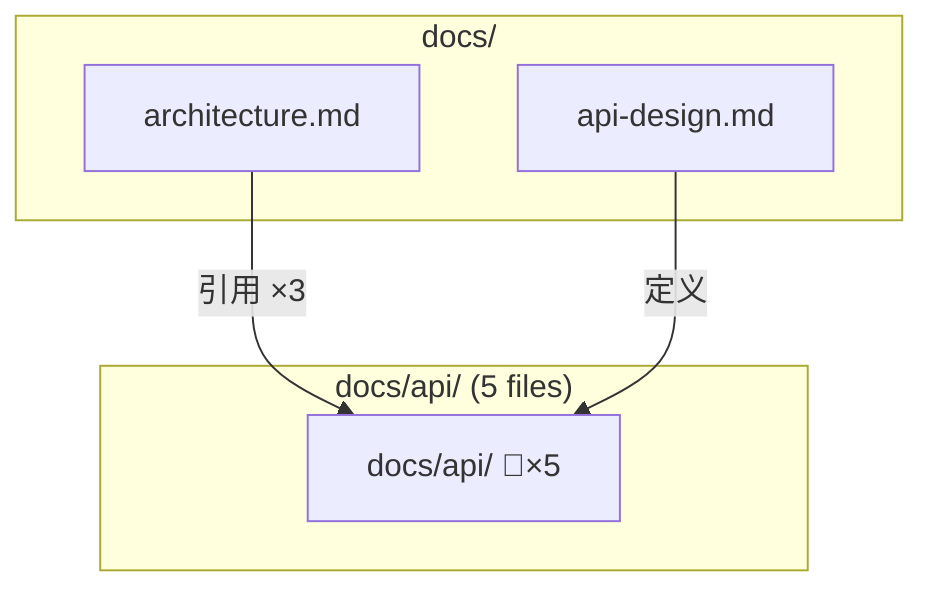

# Architectural Patterns and Design

## 核心架构决策：三层视图策略引擎

CORD 文档关系可视化面临的核心架构挑战是：**同一份关系数据，需要以不同粒度和视角呈现给不同消费者**。基于此，设计「视图策略引擎」（ViewStrategyEngine）作为核心架构模式。

### 三层视图体系

```
┌─────────────────────────────────────────────────────────┐
│                    视图策略引擎                            │
│              ViewStrategyEngine                          │
├───────────┬───────────────────┬──────────────────────────┤
│  全局视图   │    局部视图       │     路径视图              │
│  GlobalView │   LocalView      │    PathView              │
│             │                  │                          │
│  整个项目的  │  以某文档为中心   │  两个文档间的             │
│  文档关系    │  的 N 跳邻居     │  关系路径                 │
│  拓扑总览    │  上下文视图      │  追溯视图                 │
├───────────┼───────────────────┼──────────────────────────┤
│  cord graph │ cord graph show  │ cord graph path          │
│  show       │ --scope doc.md   │ --from a.md --to b.md    │
│             │ --depth 2        │                          │
└───────────┴───────────────────┴──────────────────────────┘
```

| 视图类型 | 适用场景 | 典型节点数 | 推荐布局引擎 |
|---------|---------|-----------|------------|
| **全局视图** (GlobalView) | 项目文档结构总览、新成员了解项目 | 20-200+ | elk（大规模优化） |
| **局部视图** (LocalView) | 修改文档前查看影响范围、理解依赖 | 5-30 | dagre（层次清晰） |
| **路径视图** (PathView) | 追溯两个文档间的关系链 | 3-15 | dagre（线性路径） |

### 策略模式实现

```typescript
// 视图策略接口
interface ViewStrategy {
  readonly type: ViewType;
  query(repo: RelationRepository, options: ViewOptions): Promise<GraphData>;
  configure(graphData: GraphData): MermaidConfig;
}

// 全局视图策略
class GlobalViewStrategy implements ViewStrategy {
  readonly type = 'global';

  async query(repo: RelationRepository, options: ViewOptions): Promise<GraphData> {
    const allRelations = await repo.getAllRelations();
    return this.applyGrouping(allRelations, options.groupBy ?? 'directory');
  }

  configure(graphData: GraphData): MermaidConfig {
    const nodeCount = graphData.nodes.length;
    return {
      layout: nodeCount > 50 ? 'elk' : 'dagre',
      direction: 'TB',
      maxEdges: Math.max(500, nodeCount * 3),
    };
  }
}

// 局部视图策略
class LocalViewStrategy implements ViewStrategy {
  readonly type = 'local';

  async query(repo: RelationRepository, options: ViewOptions): Promise<GraphData> {
    return repo.getNeighbors(options.scope!, options.depth ?? 2);
  }

  configure(graphData: GraphData): MermaidConfig {
    return { layout: 'dagre', direction: 'LR' };
  }
}

// 路径视图策略
class PathViewStrategy implements ViewStrategy {
  readonly type = 'path';

  async query(repo: RelationRepository, options: ViewOptions): Promise<GraphData> {
    return repo.findPaths(options.from!, options.to!);
  }

  configure(graphData: GraphData): MermaidConfig {
    return { layout: 'dagre', direction: 'LR' };
  }
}
```

## 大规模图的降级与分片策略

### 关键约束：Mermaid maxEdges 默认 500

Mermaid.js 的 `maxEdges` 默认值为 **500**。超过此限制时，Mermaid 将**拒绝渲染**并抛出错误。对于中大型项目（100+ 文档），全局视图很可能超过此阈值。

_Source: [Mermaid Configuration Schema](https://mermaid.js.org/config/schema-docs/config.html)_

### 四级降级策略

```
Level 0: 直接渲染（节点 < 50, 边 < 200）
    ↓ 超限
Level 1: 目录折叠（合并同目录文档为 subgraph 摘要节点）
    ↓ 仍超限
Level 2: 关系过滤（只显示 strong 关系，隐藏 weak 引用）
    ↓ 仍超限
Level 3: 分片输出（按目录/模块拆分为多张子图 + 概览图）
```

| 级别 | 策略 | 触发条件 | 效果 |
|------|------|---------|------|
| **L0** | 直接渲染 | 节点 < 50 且 边 < 200 | 完整细节 |
| **L1** | 目录折叠 | 节点 50-150 或 边 200-400 | 同目录文档合并为 1 个 subgraph 摘要节点 |
| **L2** | 关系过滤 | L1 后仍超限 | 只保留 composition/authority/consistency 关系 |
| **L3** | 分片输出 | L2 后仍超限 | 拆为多张图 + 1 张概览图 |

### 目录折叠策略（L1）详细设计

```typescript
class DirectoryCollapser {
  collapse(graphData: GraphData, maxNodes: number): GraphData {
    // 1. 按目录分组
    const groups = this.groupByDirectory(graphData.nodes);

    // 2. 贪心折叠：从最深目录开始，将叶子目录合并为摘要节点
    while (this.nodeCount(groups) > maxNodes) {
      const deepest = this.findDeepestGroup(groups);
      this.mergeToSummary(deepest, groups);
      // 摘要节点: "docs/api/ (5 files)" 替代 5 个独立节点
    }

    // 3. 合并后的边：如果多条边指向同一摘要节点，合并为 1 条并标注数量
    return this.rebuildGraph(groups);
  }
}
```

Mermaid DSL 效果示例：



### 分片输出策略（L3）详细设计

```typescript
class GraphShardingEngine {
  shard(graphData: GraphData): ShardedOutput {
    // 1. 按目录/模块拆分为子图
    const shards = this.partitionByModule(graphData);

    // 2. 每个子图独立生成 Mermaid DSL
    const shardDiagrams = shards.map(s => this.generator.generate(s));

    // 3. 生成概览图（每个模块为 1 个节点，跨模块边为概览边）
    const overviewDiagram = this.generateOverview(shards);

    return { overview: overviewDiagram, shards: shardDiagrams };
  }
}
```

## DSL 生成器架构：Builder 模式

### MermaidGenerator Builder 设计

```typescript
class MermaidDSLBuilder {
  private lines: string[] = [];
  private classDefMap = new Map<string, string>();

  // 声明图类型和方向
  graph(direction: 'TB' | 'LR' | 'BT' | 'RL' = 'TB'): this {
    this.lines.push(`graph ${direction}`);
    return this;
  }

  // 添加节点（自动根据类型选择形状）
  node(id: string, label: string, type?: DocumentType): this {
    const shape = this.getShape(type);
    this.lines.push(`    ${id}${shape.open}"${this.escape(label)}"${shape.close}`);
    return this;
  }

  // 添加边（自动根据关系类型选择样式）
  edge(from: string, to: string, relation: RelationType, label?: string): this {
    const style = this.getEdgeStyle(relation);
    const labelStr = label ? `|${label}|` : '';
    this.lines.push(`    ${from} ${style.left}${labelStr} ${to}`);
    return this;
  }

  // 开始 subgraph
  subgraphStart(id: string, title: string): this {
    this.lines.push(`    subgraph ${id}["${title}"]`);
    return this;
  }

  // 结束 subgraph
  subgraphEnd(): this {
    this.lines.push(`    end`);
    return this;
  }

  // 添加样式类定义
  classDef(name: string, styles: string): this {
    this.classDefMap.set(name, styles);
    return this;
  }

  // 构建最终 DSL
  build(): string {
    const classDefs = [...this.classDefMap.entries()]
      .map(([name, styles]) => `    classDef ${name} ${styles}`);
    return [...this.lines, ...classDefs].join('\n');
  }

  // 内部：关系类型 → 边样式映射
  private getEdgeStyle(relation: RelationType): EdgeStyle {
    const map: Record<RelationType, EdgeStyle> = {
      composition:  { left: '==>' },
      reference:    { left: '-->' },
      dependency:   { left: '-.->' },
      authority:    { left: '-->' },  // + style 高亮
      consistency:  { left: '<-->' },
      implements:   { left: '-.->' },
      extends:      { left: '-->' },
    };
    return map[relation] ?? { left: '-->' };
  }

  // 内部：文档类型 → 节点形状映射
  private getShape(type?: DocumentType): NodeShape {
    const map: Record<string, NodeShape> = {
      markdown:  { open: '["', close: '"]' },      // 矩形
      directory: { open: '{"', close: '"}' },       // 菱形
      config:    { open: '[("', close: '")]' },     // 圆柱形
      image:     { open: '(("', close: '"))' },     // 圆形
    };
    return map[type ?? 'markdown'] ?? { open: '["', close: '"]' };
  }

  private escape(text: string): string {
    return text.replace(/"/g, '#quot;');
  }
}
```

### Builder 使用示例

```typescript
const dsl = new MermaidDSLBuilder()
  .graph('LR')
  .subgraphStart('docs', '📁 docs/')
    .node('arch', 'architecture.md', 'markdown')
    .node('api', 'api-design.md', 'markdown')
  .subgraphEnd()
  .subgraphStart('src', '📁 src/')
    .node('svc', 'auth-service.ts', 'markdown')
  .subgraphEnd()
  .edge('arch', 'api', 'reference', '引用')
  .edge('api', 'svc', 'implements', '实现')
  .classDef('authority', 'fill:#ffd700,stroke:#333,stroke-width:2px')
  .build();
```

## 缓存与增量更新架构

### 缓存策略

```
┌──────────────────────────────────────────┐
│            缓存层 (GraphCache)            │
├──────────────────────────────────────────┤
│  Level 1: 查询缓存                       │
│  key: hash(scope + depth + filters)      │
│  value: GraphData (从 SQLite 查询的结果)  │
│  TTL: 与文件系统 mtime 比对              │
├──────────────────────────────────────────┤
│  Level 2: DSL 缓存                       │
│  key: hash(GraphData + viewOptions)      │
│  value: Mermaid DSL 字符串               │
│  TTL: 与 Level 1 同步失效                │
├──────────────────────────────────────────┤
│  Level 3: 渲染缓存（可选）                │
│  key: hash(DSL + format + theme)         │
│  value: SVG/PNG 文件路径                  │
│  TTL: 与 Level 2 同步失效                │
└──────────────────────────────────────────┘
```

| 缓存级别 | 存储位置 | 失效条件 | 适用场景 |
|---------|---------|---------|---------|
| **L1 查询缓存** | 内存 (Map) | 文档 mtime 变更 / `cord scan` 更新 | CLI 会话内重复查询 |
| **L2 DSL 缓存** | `.cord/cache/` 文件 | L1 失效 | 跨会话 DSL 复用 |
| **L3 渲染缓存** | `.cord/cache/` 文件 | L2 失效 | SVG/PNG 渲染代价高 |

### 增量更新机制

```typescript
class IncrementalGraphUpdater {
  async shouldRegenerate(cacheKey: string): Promise<boolean> {
    const cached = await this.cache.get(cacheKey);
    if (!cached) return true;

    // 检查关系数据是否有变更
    const lastScanTimestamp = await this.repo.getLastScanTimestamp();
    return lastScanTimestamp > cached.generatedAt;
  }
}
```

**设计原则**：DSL 生成的计算成本很低（纯字符串拼接），主要瓶颈在 SVG/PNG 渲染（Puppeteer 启动 + 页面渲染）。因此 L3 渲染缓存的收益最大。

## 主题与样式架构

### CORD 预定义主题

```typescript
const CORD_THEMES: Record<string, MermaidThemeConfig> = {
  default: {
    theme: 'default',
    themeVariables: {
      primaryColor: '#4A90D9',
      primaryTextColor: '#333',
      lineColor: '#666',
      secondaryColor: '#F5F5F5',
    }
  },
  dark: {
    theme: 'dark',
    themeVariables: {
      primaryColor: '#1a73e8',
      primaryTextColor: '#e8eaed',
      lineColor: '#9aa0a6',
    }
  },
  minimal: {
    theme: 'neutral',
    themeVariables: {
      primaryColor: '#fff',
      primaryBorderColor: '#333',
      lineColor: '#333',
    }
  }
};
```

### 关系类型色彩编码

| 关系类型 | 颜色 | Mermaid classDef |
|---------|------|-----------------|
| composition (组合) | 🔵 蓝色 | `fill:#4A90D9,stroke:#2C5F8A` |
| reference (引用) | 🟢 绿色 | `fill:#5CB85C,stroke:#3D8B3D` |
| dependency (依赖) | 🟡 黄色 | `fill:#F0AD4E,stroke:#C17D10` |
| authority (权威) | 🟠 金色 | `fill:#FFD700,stroke:#B8960F,stroke-width:3px` |
| consistency (一致性) | 🔴 红色 | `fill:#D9534F,stroke:#A02622` |

## 错误处理与优雅降级

```typescript
class VisualizationErrorHandler {
  handle(error: VisualizationError, context: GraphOptions): VisualizationResult {
    switch (error.type) {
      case 'GRAPH_TOO_LARGE':
        // 自动降级到 L1（目录折叠）
        return this.retryWithCollapse(context);

      case 'MERMAID_CLI_NOT_INSTALLED':
        // 降级输出 Mermaid DSL 文本
        return { type: 'text', content: context.dsl,
          hint: '💡 安装 @mermaid-js/mermaid-cli 可输出 SVG/PNG' };

      case 'RENDER_TIMEOUT':
        // 降级到更简单的视图
        return this.retryWithSimplifiedView(context);

      case 'NO_RELATIONS':
        return { type: 'text', content: '📭 未发现文档关系。请先运行 cord scan' };
    }
  }
}
```

## ADR 决策记录

| ADR | 决策 | 理由 | 替代方案 |
|-----|------|------|---------|
| **ADR-V1** | Mermaid DSL 文本为默认输出格式 | 零依赖、AI 友好、IDE 原生预览、版本控制友好 | SVG 默认（需 Puppeteer） |
| **ADR-V2** | mermaid-cli 为可选依赖 | 避免核心包膨胀（Puppeteer ~300MB） | 内置 JSDOM 渲染（功能不完整） |
| **ADR-V3** | 策略模式实现三层视图 | 视图类型可扩展、查询逻辑解耦 | if-else 硬编码（不可扩展） |
| **ADR-V4** | Builder 模式生成 DSL | 类型安全、可测试、避免字符串模板错误 | 字符串模板拼接（易出错） |
| **ADR-V5** | 四级降级策略应对大规模图 | maxEdges=500 约束、渐进优雅降级 | 直接报错拒绝渲染 |
| **ADR-V6** | dagre 默认 + elk 大图自动切换 | dagre 中小图效果好 + elk 大图优化 | 固定单一引擎 |
| **ADR-V7** | 三级缓存（查询/DSL/渲染） | DSL 生成快（ms级）、渲染慢（秒级），缓存渲染结果收益最大 | 无缓存（重复渲染浪费） |

_Source: [Mermaid Configuration Schema](https://mermaid.js.org/config/schema-docs/config.html)、[Mermaid Layouts](https://mermaid.js.org/config/layouts.html)、TR1-TR7 CORD 架构决策_
