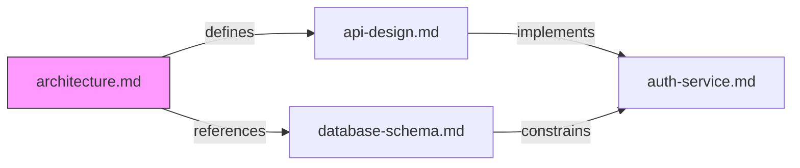
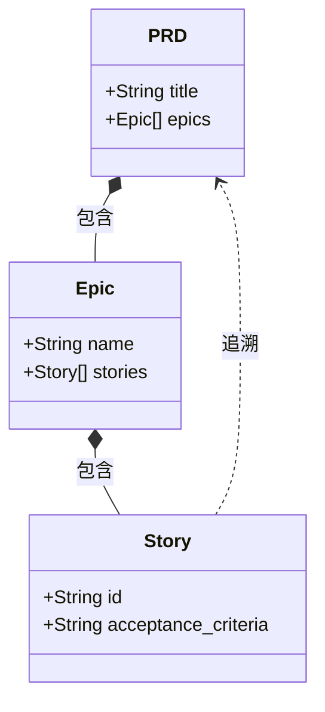

# Integration Patterns Analysis

## CORD 可视化集成全景图

基于 TR1-TR7 已确立的架构决策，Mermaid 可视化层需要在以下 **5 个集成点** 与 CORD 核心系统交互：

```
┌─────────────────────────────────────────────────────────┐
│                    消费端 (Consumers)                     │
│  ① CLI Terminal    ② IDE Preview    ③ GitHub/GitLab     │
│  ④ MCP Tool 响应   ⑤ Markdown 嵌入文档                   │
├─────────────────────────────────────────────────────────┤
│                 可视化服务层 (New)                        │
│  VisualizationService                                   │
│  ├── MermaidGenerator   (数据 → Mermaid DSL 文本)       │
│  ├── MermaidRenderer    (DSL → SVG/PNG 文件)            │
│  └── ViewStrategyEngine (全局/局部/路径视图策略)          │
├─────────────────────────────────────────────────────────┤
│           已有共享 Service 层 (TR5 已确定)                │
│  RelationService    ScanService    ConfigService        │
├─────────────────────────────────────────────────────────┤
│           已有数据访问层 (TR1 已确定)                     │
│  RelationRepository (SQLite, better-sqlite3)            │
│  ├── nodes 表 (文档节点)                                 │
│  └── edges 表 (关系边)                                   │
└─────────────────────────────────────────────────────────┘
```

## 集成点 ①：CLI 命令集成（`cord graph`）

### 命令设计（衔接 TR5 Commander.js 架构）

```
cord graph show [--scope <doc>] [--depth <n>] [--format mermaid|svg|png] [--output <file>]
cord graph export [--format mermaid|svg|png|pdf] [--output <file>] [--theme dark|light]
```

| 参数 | 说明 | 默认值 |
|------|------|--------|
| `--scope <doc>` | 以指定文档为中心的局部视图 | 无（全局视图） |
| `--depth <n>` | 关系展开深度 | 2 |
| `--format` | 输出格式 | `mermaid`（纯文本 DSL） |
| `--output <file>` | 输出文件路径 | stdout |
| `--theme` | Mermaid 主题 | `default` |
| `--layout` | 布局引擎 | `dagre`（小图）/ `elk`（大图自动切换） |

### CLI 输出策略（衔接 TR5 双模式输出）

| 格式 | 输出方式 | 依赖 | 使用场景 |
|------|---------|------|---------|
| `mermaid` | stdout 输出 Mermaid DSL 文本 | 无额外依赖 | 管道组合、IDE 预览、Markdown 嵌入 |
| `svg` | 调用 mermaid-cli (mmdc) 渲染 | @mermaid-js/mermaid-cli (Puppeteer) | 高质量矢量图输出 |
| `png` | 调用 mermaid-cli (mmdc) 渲染 | @mermaid-js/mermaid-cli (Puppeteer) | 兼容性最强的位图输出 |
| `json` | stdout 输出关系数据 JSON | 无额外依赖 | 编程集成、后处理 |

**关键设计决策**：`mermaid` 格式为**默认且零依赖**输出，SVG/PNG 渲染为**可选功能**，mermaid-cli 作为 `optionalDependencies` 或提示用户按需安装。

```typescript
// src/services/visualization-service.ts（伪代码示意）
class VisualizationService {
  constructor(
    private relationRepo: RelationRepository,
    private mermaidGenerator: MermaidGenerator,
    private mermaidRenderer?: MermaidRenderer  // 可选，按需注入
  ) {}

  async generateGraph(options: GraphOptions): Promise<GraphOutput> {
    // 1. 从 SQLite 查询关系数据
    const relations = await this.relationRepo.getRelations(options.scope, options.depth);

    // 2. 生成 Mermaid DSL 文本
    const mermaidDSL = this.mermaidGenerator.generate(relations, options);

    // 3. 根据格式决定输出
    if (options.format === 'mermaid') return { type: 'text', content: mermaidDSL };
    if (options.format === 'json') return { type: 'json', content: relations };

    // 4. SVG/PNG 需要渲染器
    if (!this.mermaidRenderer) throw new Error('mermaid-cli not installed');
    return this.mermaidRenderer.render(mermaidDSL, options.format, options.theme);
  }
}
```

_Source: TR5 CLI 架构决策（`technical-nodejs-cli-framework-research-2026-04-01.md`）_

## 集成点 ②：MCP Server Tool 集成

### Tool 定义（衔接 TR2 MCP SDK 架构）

| MCP Tool 名称 | CLI 命令 | 说明 |
|---------------|----------|------|
| `graph.show` | `cord graph show` | 返回 Mermaid DSL 文本（AI 可直接渲染） |
| `graph.export` | `cord graph export` | 生成文件并返回文件路径 |

```typescript
// src/mcp/tools/graph-tools.ts（伪代码示意）
server.tool('graph.show', {
  scope: z.string().optional().describe('以指定文档路径为中心'),
  depth: z.number().default(2).describe('关系展开深度'),
  layout: z.enum(['dagre', 'elk']).default('dagre'),
}, async ({ scope, depth, layout }) => {
  const result = await visualizationService.generateGraph({
    scope, depth, format: 'mermaid', layout
  });
  return { content: [{ type: 'text', text: result.content }] };
});
```

**MCP 场景的特殊价值**：AI 助手收到 Mermaid DSL 文本后可以：
1. 直接在聊天中渲染为图表（Claude/GPT 支持 Mermaid 渲染）
2. 分析图结构并回答关系查询
3. 基于图结构建议文档修改影响范围

_Source: TR2 MCP Server 架构决策（`technical-mcp-server-typescript-sdk-research-2026-03-31.md`）_

## 集成点 ③：Markdown 文档嵌入

### 方案对比：remark-mermaidjs vs rehype-mermaid vs 纯文本嵌入

| 方案 | 描述 | 依赖 | CORD 推荐 |
|------|------|------|----------|
| **纯文本 \`\`\`mermaid 代码块** | 直接将 Mermaid DSL 写入 Markdown | 无 | ⭐⭐⭐⭐⭐ **首选** |
| **rehype-mermaid** | unified/rehype 管道中渲染为内联 SVG/PNG | Playwright + Chromium | ⭐⭐⭐ 备选 |
| **remark-mermaidjs** | unified/remark 管道中渲染（官方建议用 rehype-mermaid） | Playwright + Chromium | ⭐⭐ 不推荐 |

**首选方案理由**：

CORD 的 Markdown 嵌入场景是**生成**而非**消费**——即 CORD 生成包含 ```` ```mermaid ```` 代码块的 Markdown 文件，渲染由消费端（GitHub/GitLab/VS Code/Obsidian）负责。这意味着：

1. **零额外依赖** — 不需要 Playwright/Chromium
2. **全平台原生渲染** — GitHub、GitLab、VS Code、Obsidian 均原生支持 ```` ```mermaid ````
3. **版本控制友好** — 纯文本 diff 可读
4. **AI 友好** — Mermaid DSL 文本可被 AI 助手直接解析和修改

```markdown
<!-- CORD 生成的 Markdown 嵌入示例 -->
# 文档关系图

<!-- cord:graph scope=./architecture.md depth=2 -->

<!-- /cord:graph -->
```

**rehype-mermaid 的适用场景**（远期）：如果 CORD 未来需要生成**静态站点**（如项目文档网站），rehype-mermaid 的 `img-svg` 策略可将 Mermaid 预渲染为内联 SVG，支持暗色模式响应。

| rehype-mermaid 策略 | 描述 | 暗色模式 | CORD 适用场景 |
|---------------------|------|---------|-------------|
| `inline-svg` | 内联 SVG（默认） | ❌ | 静态站点（简单） |
| `img-svg` | `` + data URI | ✅ `<picture>` | 静态站点（推荐） |
| `img-png` | `` + base64 PNG | ✅ `<picture>` | 兼容性优先 |
| `pre-mermaid` | 保留原始代码块 | ❌ | 客户端渲染 |

_Source: [rehype-mermaid GitHub](https://github.com/remcohaszing/rehype-mermaid)、[remark-mermaidjs GitHub](https://github.com/remcohaszing/remark-mermaidjs)_

## 集成点 ④：IDE 预览兼容性（衔接 TR4 + TR7）

| IDE/平台 | Mermaid 预览方式 | CORD 集成模式 |
|---------|-----------------|-------------|
| **VS Code** | Markdown Preview Mermaid Support 扩展 | `cord graph show > doc-graph.md` → 直接预览 |
| **Cursor** | 继承 VS Code 扩展生态 | 同 VS Code |
| **GitHub** | 原生 \`\`\`mermaid 渲染 | Push 后自动渲染 |
| **GitLab** | 原生 \`\`\`mermaid 渲染 | Push 后自动渲染 |
| **Obsidian** | 原生 \`\`\`mermaid 渲染 | 直接在 Vault 中查看 |
| **JetBrains** | Mermaid 插件 | 需安装插件 |
| **Claude Code** | MCP Tool 返回 Mermaid DSL | AI 在聊天中渲染 |

**TR7 全局指令集成**：CORD 生成的 IDE 指令文件（CLAUDE.md / .cursorrules 等）中可以嵌入关系图快照，帮助 AI 助手理解项目文档结构。

## 集成点 ⑤：数据转换管道（SQLite → Mermaid DSL）

### 转换架构

```
SQLite (nodes + edges)
    ↓ RelationRepository.getRelations()
RelationData { nodes: Node[], edges: Edge[] }
    ↓ MermaidGenerator.generate()
Mermaid DSL 文本 (string)
    ↓ (可选) MermaidRenderer.render()
SVG / PNG 文件
```

### MermaidGenerator 核心映射规则

| SQLite 数据 | Mermaid 映射 | 示例 |
|-------------|-------------|------|
| `node.path` | 节点 ID + 标签 | `A["docs/arch.md"]` |
| `node.type` | 节点形状 | `.md` → `["文档形"]`、目录 → `{"文件夹形"}` |
| `edge.relation_type` | 边样式 + 标签 | `composition` → `==>|组合|`、`reference` → `-->|引用|` |
| `edge.direction` | 箭头方向 | `A --> B` 或 `A --- B`（双向） |
| `edge.strength` | 边粗细 | `strong` → `==>`, `weak` → `-.->` |
| 目录层级 | Subgraph 嵌套 | `subgraph docs/; ...; end` |

### 关系类型 → Mermaid 边样式映射表

| 关系类型 | Mermaid 语法 | 视觉效果 |
|---------|-------------|---------|
| `composition` (组合) | `A ==>|组合| B` | 粗实线箭头 |
| `reference` (引用) | `A -->|引用| B` | 实线箭头 |
| `dependency` (依赖) | `A -.->|依赖| B` | 虚线箭头 |
| `authority` (权威) | `A -->|权威| B` + `style` 高亮 | 实线箭头 + 金色高亮 |
| `consistency` (一致性) | `A <-->|一致| B` | 双向箭头 |
| `implements` (实现) | `A -.->|实现| B` | 虚线箭头 |
| `extends` (扩展) | `A -->|扩展| B` | 实线箭头 |

### Class Diagram 作为补充视图

当关系具有明确的类型层次时（如 PRD → Epic → Story），Class Diagram 的继承/组合语法更精确：



## 渲染引擎集成策略

### 分层渲染架构

```
┌─────────────────────────────────────────┐
│          MermaidRenderer (接口)          │
├─────────────────────────────────────────┤
│  TextRenderer          FileRenderer     │
│  (纯文本 DSL 输出)     (SVG/PNG 文件)   │
│  ↓                     ↓                │
│  零依赖               mermaid-cli (mmdc)│
│  stdout/string         Puppeteer        │
└─────────────────────────────────────────┘
```

| 渲染器 | 实现 | 依赖 | 安装策略 |
|-------|------|------|---------|
| **TextRenderer** | 直接返回 DSL 字符串 | 无 | 核心包内置 |
| **FileRenderer** | 调用 `@mermaid-js/mermaid-cli` 的 `run()` API | mermaid-cli + Puppeteer | `optionalDependencies` 或按需 `npx` 调用 |

### 按需安装策略（避免 Puppeteer 膨胀）

```typescript
// 检测 mermaid-cli 是否可用
async function getMermaidRenderer(): Promise<MermaidRenderer | null> {
  try {
    const { run } = await import('@mermaid-js/mermaid-cli');
    return new FileRenderer(run);
  } catch {
    return null; // mermaid-cli 未安装
  }
}

// CLI 使用时优雅降级
if (format !== 'mermaid' && !renderer) {
  console.log('💡 SVG/PNG 输出需要安装 mermaid-cli:');
  console.log('   npm install -g @mermaid-js/mermaid-cli');
  console.log('   或使用 --format mermaid 输出纯文本（推荐）');
}
```

## 安全与隔离

| 安全关注点 | 处理策略 |
|-----------|---------|
| **Mermaid XSS** | CLI 场景无浏览器风险；mermaid-cli 使用沙箱 Chromium |
| **用户输入注入** | DSL 生成使用模板化映射，不接受用户自由输入 Mermaid 语法 |
| **文件系统写入** | 输出路径校验，限制在项目目录内 |
| **Puppeteer 安全** | securityLevel 设为 `strict`（默认）或 `sandbox` |

_Source: [Mermaid Configuration 文档](https://mermaid.js.org/config/configuration.html)、TR5 CLI 架构决策_
