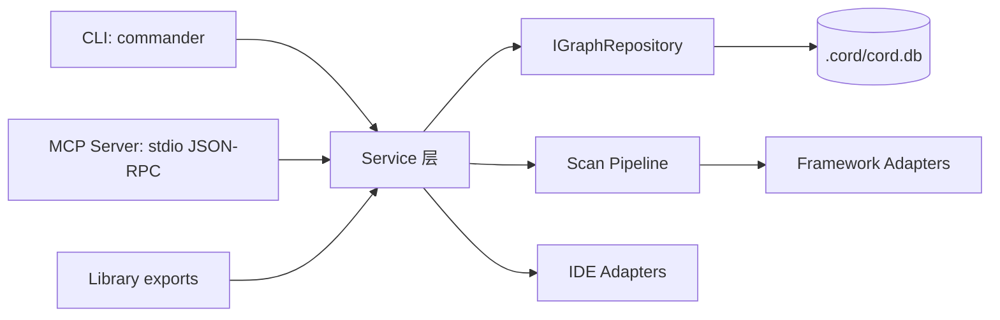
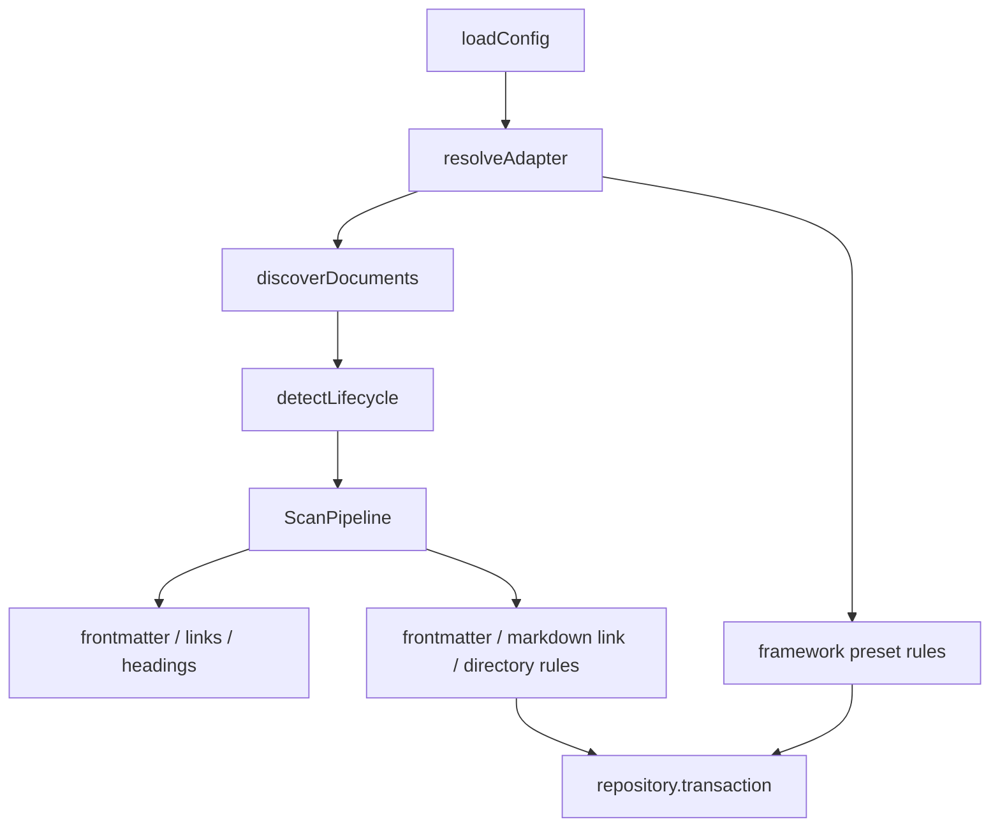

# CORD 架构文档

**生成日期：** 2026-05-21  
**扫描模式：** DP Deep Scan

## 执行摘要

CORD 采用“多入口、单内核”的分层架构。CLI、MCP Server 和 library exports 都围绕同一组 Service、Repository、Scanner 和 Adapter 运行。这样的结构让人类用户通过 CLI 操作图谱，也让 AI IDE 通过 MCP Tool 调用同一套业务能力。



## 分层结构

| 层        | 目录                         | 职责                                               |
| --------- | ---------------------------- | -------------------------------------------------- |
| L3 入口层 | `src/cli/`, `src/mcp/`       | 解析输入、协议/格式适配、调用 Service、输出结果    |
| L2 业务层 | `src/services/`              | 扫描、查询、影响分析、导出、状态、初始化、关系管理 |
| L1 数据层 | `src/repositories/`          | SQLite 持久化、迁移、事务、mapper、统计            |
| 扫描引擎  | `src/scanner/`               | Markdown AST 解析、关系规则、生命周期检测          |
| 适配器层  | `src/adapters/`              | 框架文档结构适配、IDE 文件生成与检测               |
| 契约层    | `src/schemas/`, `src/types/` | Zod schema、公共 DTO、枚举和配置类型               |

## 入口架构

### CLI

CLI 入口在 `src/cli/index.ts`。`createProgram()` 注册 6 个子命令：

- `scan`
- `query`
- `impact`
- `export`
- `status`
- `init`

每个命令位于 `src/cli/commands/`，以工厂函数形式创建，支持依赖注入以便测试。命令层负责：

- 读取 `process.cwd()` 或测试注入的 cwd。
- 在创建默认 Service 之前完成输入校验和路径归一化。
- 将成功结果输出为人类可读文本或 `--json`。
- 将错误封装为稳定 payload，并设置退出码。
- 在 `finally` 中关闭 Service/Repository 资源。

CLI 不承载关系管理命令。手动新增、删除和标记 deprecated 关系通过 MCP Tool 暴露。

### MCP Server

MCP Server 入口在 `src/mcp/server.ts`。核心创建链路是：

```text
createCordMcpRuntime()
  -> createCordMcpServer()
  -> startCordMcpServer()
  -> runMcpServer()
```

MCP Server 注册 7 个 Tool：

| Tool                 | 读写 | 对应 Service      |
| -------------------- | ---- | ----------------- |
| `query_relations`    | 读   | `QueryService`    |
| `analyze_impact`     | 读   | `ImpactService`   |
| `init_graph`         | 写   | `ScanService`     |
| `sync_docs`          | 读   | `ImpactService`   |
| `add_relation`       | 写   | `RelationService` |
| `remove_relation`    | 写   | `RelationService` |
| `deprecate_relation` | 写   | `RelationService` |

MCP 的 stdout 专用于 JSON-RPC。日志、诊断和关闭信息必须走 stderr。这一点由 logger 的 MCP 模式和 server 运行时共同保护。

### Library exports

`src/index.ts` 重新导出 adapters、repositories、scanner、schemas、services、types 和 utils。打包配置会生成 `dist/index.js` 与类型声明，供外部代码按库方式复用。

## Service 层

| Service           | 文件                               | 职责                                                       |
| ----------------- | ---------------------------------- | ---------------------------------------------------------- |
| `ScanService`     | `src/services/scan-service.ts`     | 加载配置、解析框架适配器、发现文档、运行扫描管道、写入图谱 |
| `QueryService`    | `src/services/query-service.ts`    | 1 到 3 跳 BFS 关系查询，支持类型与 deprecated 状态过滤     |
| `ImpactService`   | `src/services/impact-service.ts`   | 按关系传播矩阵计算受影响文档、严重度、动作建议和更新策略   |
| `RelationService` | `src/services/relation-service.ts` | MCP 关系管理：手动添加、删除、标记 deprecated              |
| `ExportService`   | `src/services/export-service.ts`   | 导出稳定 JSON 快照，使用临时文件和原子 rename              |
| `StatusService`   | `src/services/status-service.ts`   | 返回图谱健康、迁移版本、孤立节点和悬空关系等状态           |
| `InitService`     | `src/services/init-service.ts`     | IDE 检测、配置文件写入、MCP 配置和指令文件生成             |

Service 层是业务逻辑的主场。CLI 和 MCP 只是不同入口，最后都落到这些 Service 上。

## 数据架构

SQLite 数据库默认位于 `.cord/cord.db`。Repository 接口是同步 API，因为 `better-sqlite3` 是同步库。

主要表：

| 表                  | 说明                                                                     |
| ------------------- | ------------------------------------------------------------------------ |
| `documents`         | 文档节点，`path` 唯一，保存 docType、framework、hash 和 metadata         |
| `relations`         | 文档关系边，保存 source/target、relationType、confidence、source、status |
| `sync_states`       | 增量扫描状态，保存 mtime、contentHash 和 lastScannedAt                   |
| `schema_migrations` | 已执行迁移版本                                                           |

关系状态 `deprecated` 是独立状态位，不改变原始 `relationType`。这让历史关系可以被追溯，同时默认查询和影响分析可以只处理 active 关系。

## 扫描架构



扫描引擎由 `ScanPipeline` 和框架适配器共同组成：

- `ScanPipeline` 使用 unified/remark 解析 Markdown。
- 插件提取 frontmatter、链接、标题和 content hash。
- 规则层把显式 frontmatter、Markdown 链接和目录结构映射成关系。
- Framework adapter 提供扫描路径、排除路径、文档类型和预设关系。
- 生命周期检测识别新增、修改、删除、移动和重命名。

## 框架适配器

适配器契约是 `IFrameworkAdapter`，基类是 `AbstractFrameworkAdapter`。

当前内置：

- `BmadFrameworkAdapter`：识别 `_bmad/`、`_bmad-output/`、skills、BMAD frontmatter 等信号；默认扫描 `_bmad-output` 与 `docs`；提供 BMAD 文档类型和预设关系。
- `GenericFrameworkAdapter`：兜底适配器，提供通用 Markdown 扫描，无框架专属预设关系。

适配器让 CORD 的核心扫描流程不需要理解每个方法论框架的目录细节。新增框架时应实现适配器，而不是改动核心扫描服务。

## IDE 适配器

IDE 适配器契约是 `IIdeAdapter`。当前支持：

| IDE             | 生成内容                                                                   |
| --------------- | -------------------------------------------------------------------------- |
| Claude Code     | `.claude/settings.json`、规则文件、PostToolUse Hook、CORD Skills           |
| Cursor          | `.cursor/mcp.json`、`.cursor/rules/cord-relations.mdc`                     |
| VS Code Copilot | `.vscode/mcp.json`、`.github/copilot-instructions.md`、`AGENTS.md` CORD 段 |
| Codex CLI       | `AGENTS.md` CORD 段                                                        |

IDE 适配器坚持零侵入策略：除 `AGENTS.md` 的 CORD 专属段落外，不覆盖用户已有配置。

## 关键契约

- 所有 TypeScript import 路径使用 `.js` 后缀。
- Service 层依赖接口，不直接依赖 SQLite 具体类。
- Repository 层负责 snake_case 数据库字段与 camelCase 代码字段转换。
- 所有公共输入通过 Zod schema 验证。
- CLI 命令的配置错误退出码为 2，运行时错误退出码为 1。
- MCP Tool schema 是 CLI JSON 和 Service DTO 的共享契约来源之一。

## 测试与质量门禁

- Vitest 覆盖 `tests/unit/` 与 `tests/integration/`。
- 覆盖率门禁为 lines/functions/branches/statements 80%。
- CI workflow 包含质量检查，cross-platform workflow 覆盖多平台行为。
- `src/cli/index.ts` 不排除覆盖率，因为其中包含真实入口守卫和 verbose 逻辑。

## 主要风险

| 风险                | 说明                                         | 缓解方式                                        |
| ------------------- | -------------------------------------------- | ----------------------------------------------- |
| CLI 与 MCP 契约漂移 | 两个入口共享 Service，但输出格式仍需同步维护 | 共享 schema、集成测试和文档对照                 |
| 扫描误判            | 自动扫描无法保证 100% 准确                   | MCP 关系管理支持人工修正与收敛                  |
| 路径安全            | CLI/MCP 都接受路径输入                       | 输入归一化、项目根边界校验、export 物理路径检查 |
| 本地数据库一致性    | 扫描、导出、状态读取都依赖 SQLite            | Repository 事务、迁移、WAL、状态诊断            |
