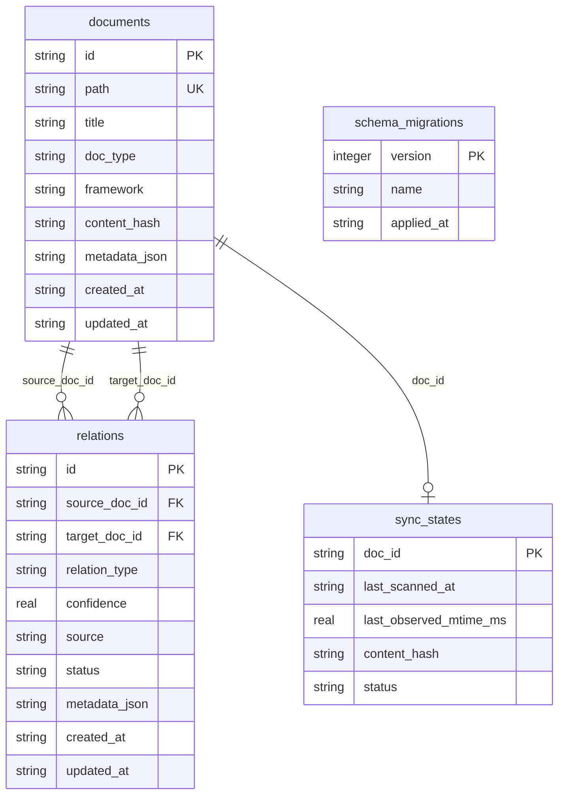

# CORD 数据模型

**生成日期：** 2026-05-21  
**扫描模式：** DP Deep Scan

## 总览

CORD 的持久化模型是一个本地文档关系图谱。节点是文档，边是文档间关系，扫描状态用于增量扫描。数据库使用 SQLite，通过 `better-sqlite3` 同步 API 访问。

## Repository 接口

Service 层只依赖 `IGraphRepository`。默认实现是 `SqliteGraphRepository`。

接口分组：

| 分组     | 方法示例                                                                                       | 用途                    |
| -------- | ---------------------------------------------------------------------------------------------- | ----------------------- |
| 文档节点 | `addDocument`, `getDocumentByPath`, `updateDocument`, `deleteDocument`                         | 管理图谱节点            |
| 关系边   | `addRelation`, `getRelationsByDocId`, `getRelationsByType`, `updateRelation`, `deleteRelation` | 管理图谱边              |
| 同步状态 | `getSyncState`, `upsertSyncState`, `getAllSyncStates`                                          | 支持增量扫描            |
| 事务     | `transaction<T>(fn)`                                                                           | 保证扫描/关系写入一致性 |
| 统计     | `getDocumentCount`, `getRelationCount`                                                         | 支持 status 和健康检查  |
| 生命周期 | `close`                                                                                        | 释放 SQLite 连接        |

## DocumentNode

代码类型位于 `src/types/documents.ts`。

| 字段          | 说明                                        |
| ------------- | ------------------------------------------- |
| `id`          | UUID，由 Repository 生成                    |
| `path`        | project-relative POSIX path，唯一           |
| `title`       | 文档标题，可由扫描管道提取                  |
| `docType`     | 文档类型，如 `prd`、`architecture`、`story` |
| `framework`   | 识别到的框架，如 `bmad`、`generic`          |
| `contentHash` | 文件内容哈希，用于增量扫描                  |
| `metadata`    | 扩展元数据，数据库中以 JSON 保存            |
| `createdAt`   | ISO 8601 创建时间                           |
| `updatedAt`   | ISO 8601 更新时间                           |

## RelationEdge

代码类型位于 `src/types/graph.ts` 与 `src/types/relations.ts`。

| 字段           | 说明                                        |
| -------------- | ------------------------------------------- |
| `id`           | UUID，由 Repository 生成                    |
| `sourceDocId`  | 源文档 ID                                   |
| `targetDocId`  | 目标文档 ID                                 |
| `relationType` | 9 种关系类型之一                            |
| `confidence`   | 0 到 1 之间的置信度                         |
| `source`       | `auto_scan`、`manual` 或 `framework_preset` |
| `status`       | `active` 或 `deprecated`                    |
| `metadata`     | 规则名、来源路径等扩展信息                  |
| `createdAt`    | ISO 8601 创建时间                           |
| `updatedAt`    | ISO 8601 更新时间                           |

## 关系类型

| 类型              | 含义                                                        |
| ----------------- | ----------------------------------------------------------- |
| `sync_required`   | 源文档变化后目标文档必须同步                                |
| `context_for`     | 目标文档为源文档提供背景上下文                              |
| `lifecycle_bound` | 两份文档生命周期绑定                                        |
| `contains`        | 源文档逻辑上包含目标文档                                    |
| `must_consistent` | 两份文档内容必须保持一致                                    |
| `sync_suggested`  | 建议同步但不是强制                                          |
| `derived_from`    | 目标文档从源文档派生                                        |
| `deprecated`      | 废弃关系类型；当前更推荐使用 `status='deprecated'` 下线关系 |
| `references`      | 弱引用关系                                                  |

ImpactService 的传播矩阵当前对所有内置关系类型使用 `source_to_target`，并且只遍历 `active` 关系。

## SyncState

`sync_states` 保存文档与磁盘文件之间的同步状态。

| 字段                  | 说明                       |
| --------------------- | -------------------------- |
| `docId`               | 文档节点 ID，也是主键      |
| `lastScannedAt`       | 最近一次扫描时间           |
| `lastObservedMtimeMs` | 上次扫描看到的文件 mtimeMs |
| `contentHash`         | 上次扫描内容哈希           |
| `status`              | `synced` 或 `modified`     |

增量扫描会结合 `mtimeMs` 和 `contentHash` 判断文档是否变更。

## 迁移系统

迁移文件位于 `src/repositories/migrations/`。

| 版本 | 目的                                                              |
| ---- | ----------------------------------------------------------------- |
| v1   | 初始 schema：documents、relations、sync_states、schema_migrations |
| v2   | 为 relations 增加 `status` 维度                                   |
| v3   | 修复 v1 基线相关兼容问题                                          |

迁移 runner 按版本升序执行，已执行版本跳过。每条迁移在事务中运行，失败时回滚。

## 关键约束

- SQLite 使用 WAL 模式。
- 外键启用并使用 cascade 删除。
- Repository 层负责 snake_case 到 camelCase 的转换。
- metadata JSON 损坏时抛 `StorageError`，不能静默吞掉。
- 关系唯一性包含 `source` 维度，因此自动扫描关系和手动关系可以并存。
- `deleteRelationsByDocId` 支持 `excludeSources`，用于保护 manual 关系。

## 服务使用模型

| Service           | 主要读取/写入                                             |
| ----------------- | --------------------------------------------------------- |
| `ScanService`     | 写入 documents、relations、sync_states                    |
| `QueryService`    | 读取 documents 与 relations                               |
| `ImpactService`   | 读取 active relations 并计算影响                          |
| `RelationService` | 写入/更新/删除 manual 关系                                |
| `ExportService`   | 全量读取 documents 与 relations                           |
| `StatusService`   | 读取 documents、relations、sync_states、migration version |

## 诊断指标

`StatusService` 会报告：

- `documentCount`
- `relationCount`
- `relationsByType`
- `lastScanTime`
- `migrationVersion`
- `staleRelations`
- `orphanedNodes`
- `danglingEdges`

这些指标帮助用户判断图谱是否已初始化、是否存在悬空关系、是否需要重新扫描。
